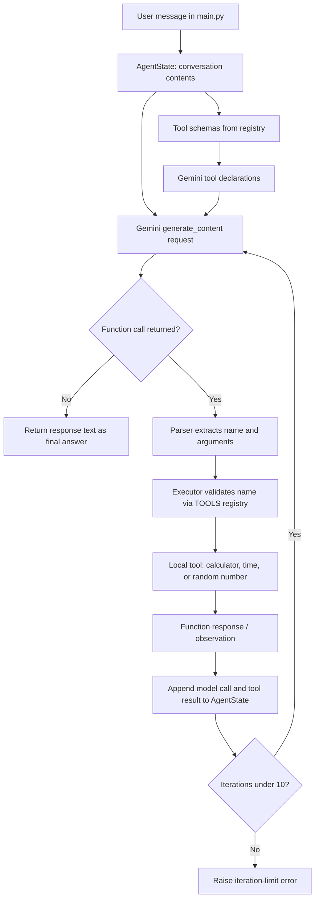

# Mini Agent 1

A small Python AI agent that uses the Google Gemini API to decide when to call local tools. It can solve basic arithmetic, read the machine's current local time, and generate a random integer. Rather than hard-coding which tool to run, the agent supplies Gemini with tool descriptions; Gemini can request one or more tools and then use their results to produce a final natural-language answer.

## Capabilities

- **Calculator** - safely evaluates numeric expressions using `+`, `-`, `*`, `/`, `%`, `**`, and unary `+`/`-`.
- **Current time** - returns the local date and time of the computer running the program.
- **Random number** - returns an integer in an inclusive range, for example `1` through `100`.
- **Multi-step tool use** - can call tools across several model turns before answering.
- **Guardrails** - rejects unknown tools, invalid random ranges, and unsupported calculator syntax. The agent also stops after 10 iterations to avoid an unbounded tool loop.

## Project structure

```text
Mini-Agent-1/
|-- main.py                 # Example prompt and application entry point
|-- requirements.txt        # Python dependencies
|-- agent/
|   |-- llm.py              # Gemini client and model request
|   |-- loop.py             # Agent/tool execution loop
|   |-- parser.py           # Extracts function calls from Gemini responses
|   `-- state.py            # Conversation history and iteration state
|-- tools/
|   |-- registry.py         # Tool implementations and LLM-facing schemas
|   |-- formatters.py       # Converts schemas into Gemini tool declarations
|   |-- executor.py         # Validates and dispatches tool calls
|   |-- calculator.py       # Safe AST-based arithmetic evaluator
|   |-- time_tool.py        # Local date/time tool
|   `-- random_number.py    # Inclusive random integer tool
`-- tests/test_tools.py     # Tool and dispatch tests
```

## Requirements

- Python 3.10 or later recommended
- A Google Gemini API key
- Internet access for Gemini API requests

## Installation

1. Clone or download this project and open a terminal in its folder.

2. Create and activate a virtual environment.

   **Windows PowerShell**

   ```powershell
   py -m venv .venv
   .\.venv\Scripts\Activate.ps1
   ```

   **macOS/Linux**

   ```bash
   python3 -m venv .venv
   source .venv/bin/activate
   ```

3. Install dependencies.

   ```bash
   python -m pip install -r requirements.txt
   ```

4. Create a `.env` file in the project root and add your API key:

   ```env
   GEMINI_API_KEY=your_gemini_api_key_here
   ```

   `.env` is already ignored by Git; do not commit your key.

## Run the agent

```bash
python main.py
```

`main.py` currently includes an example request that asks the agent to calculate `10 * 50 + 200`, report the current time, and produce a random integer between 1 and 100. Replace the `user_message` value in `main.py` to try another request.

During execution, the program logs each agent iteration, selected action, and the resulting observation, followed by `FINAL ANSWER`.

## How it works

The application builds Gemini-compatible function declarations from the schemas in `tools/registry.py`. It sends the user's conversation history and those declarations to the `gemini-2.5-flash-lite` model.

If Gemini replies with a function call, the agent:

1. Records Gemini's tool-call response in the conversation history.
2. Extracts each requested tool name and arguments.
3. Looks up the tool in the local registry and executes it.
4. Adds the success result or an error message to the history as a Gemini function response.
5. Asks Gemini again so it can interpret the observations and either call another tool or write the final answer.

When Gemini returns ordinary text without a function call, that text is returned as the final answer. If this does not happen within 10 iterations, the agent raises an error.

## Backend data flow



### Tool request example

For a request such as "What is `25 * 4` and what time is it?", Gemini may request the following local calls:

```text
calculator({"expression": "25 * 4"})  -> 100
time({})                                -> 2026-08-25 14:30:00
```

The exact time naturally depends on the computer and moment of execution. Those observations are sent back to Gemini, which composes the final response.

## Calculator safety

The calculator does **not** use Python's `eval()`. It parses the expression into an abstract syntax tree (AST) and permits only numeric constants and a small allowlist of arithmetic operations. Names, attribute access, function calls, strings, and other Python constructs are rejected.

## Tests

Run the test suite with:

```bash
python -m pytest
```

The tests cover calculator operations, time-tool output, registry dispatch, unknown tools, and valid/invalid random-number ranges.

## Adding a tool

1. Implement a Python function in `tools/`.
2. Add the function to `TOOLS` in `tools/registry.py`.
3. Add a matching `ToolDefinition` with its JSON-schema arguments to `TOOL_SCHEMAS`.
4. Add focused tests in `tests/test_tools.py`.

`get_llm_tools()` automatically exposes every registered schema to Gemini, so no other tool-declaration change is required.
