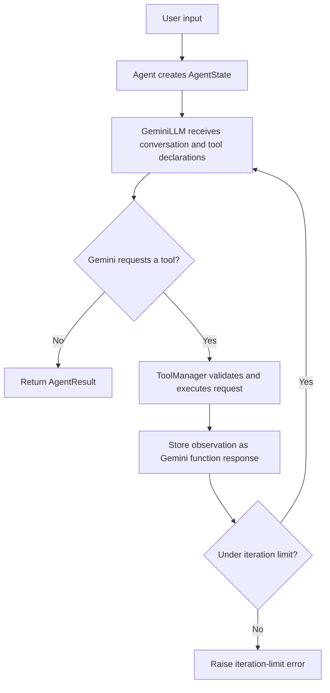

# Mini Agent 1

A command-line AI agent powered by Google Gemini. It decides when to use local tools, runs those tools safely, and returns a natural-language answer. The application preserves conversation history during a session and records the latest execution state for inspection.

## Features

- Gemini-backed agent loop using `gemini-2.5-flash` by default.
- Three local tools:
  - **Calculator**: safe AST-based arithmetic supporting `+`, `-`, `*`, `/`, `%`, `**`, and unary `+`/`-`.
  - **Time**: returns the machine's current local date and time.
  - **Random number**: returns an integer within an inclusive minimum/maximum range.
- Multi-step tool use: the model can request tools over multiple iterations before answering.
- Argument validation with Pydantic models before every tool execution.
- Tool errors are captured as observations and returned to the model rather than terminating the loop.
- Configurable iteration limit (10 by default) to prevent unbounded execution.
- Session memory, latest-run state, and structured `AgentResult` values.
- Interactive commands for help, clearing memory, viewing state, viewing tools, and exiting.
- ASCII-only CLI banner for reliable output in standard Windows consoles.

## Project structure

```text
Mini-Agent-1/
|-- main.py                         # Interactive CLI entry point
|-- requirements.txt                # Python dependencies
|-- README.md
|-- agent/
|   |-- agent.py                    # Agent facade; coordinates LLM, memory, and tools
|   |-- cli.py                      # Banner and help output
|   |-- llm_base.py                 # Abstract LLM interface
|   |-- llm.py                      # Gemini implementation of the LLM interface
|   |-- loop.py                     # Iterative model/tool execution loop
|   |-- memory.py                   # Session conversation memory
|   |-- parser.py                   # Extracts Gemini function calls
|   |-- state.py                    # Per-run state: iterations, calls, observations
|   |-- logger.py                   # Console logging helpers
|   `-- retry.py                    # Reusable tool retry helper
|-- models/
|   |-- arguments.py                # Pydantic argument models by tool name
|   |-- results.py                  # AgentResult response model
|   `-- schemas.py                  # Tool schemas and argument model definitions
|-- tools/
|   |-- manager.py                  # Supplies Gemini declarations and executes tools
|   |-- registry.py                 # Tool functions and LLM-facing schemas
|   |-- formatters.py               # Builds Gemini Tool declarations
|   |-- executor.py                 # Validates and dispatches tool calls
|   |-- calculator.py               # Safe arithmetic evaluator
|   |-- time_tool.py                # Local time tool
|   `-- random_number.py            # Inclusive random-number tool
`-- tests/
    |-- test_tools.py               # Tool execution and validation tests
    `-- test_cli_support.py         # CLI support and agent wiring tests
```

## Requirements

- Python 3.10 or newer
- A Google Gemini API key
- Internet access for Gemini API requests

## Setup

1. Create and activate a virtual environment.

   **Windows PowerShell**

   ```powershell
   py -m venv .venv
   .\.venv\Scripts\Activate.ps1
   ```

   **macOS/Linux**

   ```bash
   python3 -m venv .venv
   source .venv/bin/activate
   ```

2. Install dependencies.

   ```bash
   python -m pip install -r requirements.txt
   ```

3. Create a `.env` file in the project root.

   ```env
   GEMINI_API_KEY=your_gemini_api_key_here
   ```

   Keep this key private and do not commit the `.env` file.

## Run

```bash
python main.py
```

Enter a normal-language request, for example:

```text
Calculate 25 * 4, tell me the time, and give me a random number from 1 to 10.
```

The agent logs each iteration, requested tool, and observation while it works.

### CLI commands

| Command | Description |
| --- | --- |
| `/help` | Show available commands. |
| `/clear` | Clear saved conversation memory. |
| `/state` | Show the latest agent run's iterations, tool calls, observations, and final answer. |
| `/tools` | List the registered local tools. |
| `/exit` | Exit the program. |

## How it works



Tool definitions in `tools/registry.py` are converted to Gemini declarations by `tools/formatters.py`. For every model-requested call, `tools/executor.py` first validates the supplied arguments with the matching Pydantic model from `models/arguments.py`, then dispatches the registered function.

## Tests

Run all tests with:

```bash
python -m pytest
```

The suite covers calculator behavior, time and random-number tools, registry dispatch, invalid tool/range handling, memory clearing, Gemini tool-declaration construction, and agent-to-tool-manager wiring.

## Adding a tool

1. Implement the tool function in `tools/`.
2. Register it in `TOOLS` and add its `ToolDefinition` to `TOOL_SCHEMAS` in `tools/registry.py`.
3. Create a Pydantic argument model in `models/schemas.py` and map it in `models/arguments.py`.
4. Add focused tests.

The tool manager will automatically expose the registered schema to Gemini.
